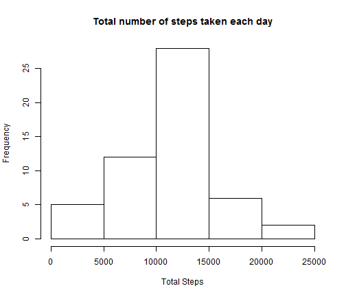

Personal activity monitoring
========================================================

It is now possible to collect a large amount of data about personal movement using activity monitoring devices such as a
[Fitbit](http://www.fitbit.com), [Nike Fuelband](http://www.nike.com/us/en_us/c/nikeplus-fuelband), or [Jawbone Up]
(https://jawbone.com/up). These type of devices are part of the 'quantified self' movement  a group of enthusiasts who
take measurements about themselves regularly to improve their health, to find patterns in their behavior, or because they
are tech geeks. But these data remain under-utilized both because the raw data are hard to obtain and there is a lack of
statistical methods and software for processing and interpreting the data.

Dataset Loaded from: [Activity monitoring data](https://d396qusza40orc.cloudfront.net/repdata%2Fdata%2Factivity.zip) 

First load above data 


```r
col_classes=c("numeric","character","numeric");
act_data <- read.csv('activity.csv',header=TRUE,colClasses=col_classes);
act_by_day <- aggregate(x=act_data,by=as.list(act_data$date),FUN=sum);
```

```
## Error: arguments must have same length
```

```r
library(sqldf);
```

```
## Loading required package: gsubfn
## Loading required package: proto
## Loading required package: RSQLite
## Loading required package: DBI
## Loading required package: RSQLite.extfuns
```

```r
act_by_Day_sql <- sqldf('select date,sum(steps) Total_Steps from act_data group by date');
```

```
## Loading required package: tcltk
```

Histogram of the total number of steps taken each day


```r
hist(as.numeric(act_by_Day_sql$Total_Steps),xlab="Total Steps",
                main="Total number of steps taken each day")
```

 


Mean total number of steps taken per day:

```r
mean(as.numeric(act_by_Day_sql$Total_Steps), na.rm = TRUE);
```

```
## [1] 10766
```

```r
median(as.numeric(act_by_Day_sql$Total_Steps), na.rm = TRUE);
```

```
## [1] 10765
```

A time series plotof the 5-minute interval (x-axis) and the average number of steps taken, averaged across all days (y-axis)


```r
act_by_5min <- sqldf('select interval,avg(steps) avg_steps from act_data group by interval');
library(ggplot2)
```


```r
ggplot(act_by_5min,aes(interval,avg_steps)) + geom_line() +xlab("5 Min Intervals") + ylab("Average Steps for all days");
```

 

maximum number of steps during 5-minute interval, on average across all the days in the dataset


```r
act_by_5min$interval[act_by_5min$avg_steps == max(act_by_5min$avg_steps)]
```

```
## [1] 835
```


Number of missing values


```r
sum(is.na(act_data$steps));
```

```
## [1] 2304
```

populate missing values


```r
act_data_clean <- na.omit(act_data);
act_day_avg <- sqldf("select date,avg(steps) steps from act_data_clean group by date ");
act_data$day <- weekdays(as.Date(act_data$date));
act_data$day_type <- "Weekday";

for(i in 1:nrow(act_data)){
    if (is.na(act_data[i,1])){
        if (is.na(act_day_avg$date[act_data[i,2]])){
          act_data[i,1] <- 0;
        }else{
          act_data[i,1] <- as.numeric(act_day_avg$avg_steps[act_day_avg$date == act_data[i,2] ]);
        }
    }
    if (act_data[i,4] == "Sunday" || act_data[i,4] == "Saturday"){
        act_data[i,5] <- "Weekend";
    }    
    
}

act_by_Day_sql <- sqldf('select date,sum(steps) Total_Steps from act_data group by date');
```

Histogram of the total number of steps taken each day - with CLEAN data


```r
hist(as.numeric(act_by_Day_sql$Total_Steps),xlab="Total Steps",
     main="Total number of steps taken each day - CLEAN data")
```

 


Mean total number of steps taken per day - with CLEAN data

```r
mean(as.numeric(act_by_Day_sql$Total_Steps));
```

```
## [1] 9354
```

```r
median(as.numeric(act_by_Day_sql$Total_Steps));
```

```
## [1] 10395
```

Mean and Median after adding missing date differ vastly, hence it is always good idea to fill missing data, and compare difference


```r
act_data$day_type <- factor(act_data$day_type);

act_clean_by_weekday <- sqldf("select avg(steps) steps, interval, day_type from act_data group by interval, day_type");
```

Weekday and weekend activity comparison


```r
qplot(interval,steps, data=act_clean_by_weekday, facets=.~day_type,color=day_type,geom = c("point","smooth"));
```

```
## geom_smooth: method="auto" and size of largest group is <1000, so using loess. Use 'method = x' to change the smoothing method.
## geom_smooth: method="auto" and size of largest group is <1000, so using loess. Use 'method = x' to change the smoothing method.
```

 
